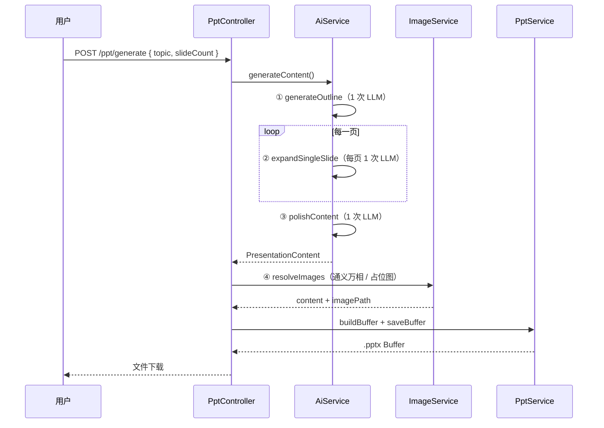

# PPT 生成流程

## 概览

```
用户输入 → LLM 生成大纲 → 逐页补充详细内容 → 全文润色 → 图片补充 → 渲染 pptx
```



## 四步详解

### 1. 用户输入要求

**入口**：`POST /ppt/generate`

```json
{ "topic": "NestJS 入门", "slideCount": 20 }
```

**代码**：`api/src/ppt/ppt.controller.ts` → `GeneratePptDto`

---

### 2. LLM 生成大纲

**职责**：确定演示标题、每页主题、目的、要点骨架、建议版式。

**代码**：`AiService.generateOutline()`

**输出结构**（`PresentationOutline`）：

```json
{
  "title": "NestJS 入门",
  "slides": [
    {
      "title": "封面",
      "purpose": "引入主题",
      "keyPoints": ["NestJS 是什么", "适用场景"],
      "suggestedLayout": "cover"
    }
  ]
}
```

**LLM 调用**：1 次，超时按页数动态计算（见 `resolveTimeoutMs`）。

---

### 3. 对每一个章节补充详细内容

**职责**：按大纲 **逐页** 调用 LLM，生成完整 slide JSON（标题、版式、要点、imagePrompt、双栏、图表等）。

**代码**：`AiService.expandSlidesFromOutline()` → 循环调用 `expandSingleSlide()`

**日志示例**：

```
expandSlide 1/20 title="封面"
LLM expand-slide-1 request start ...
expandSlide 2/20 title="NestJS 是什么"
...
```

**优点**：

- 单次请求体小，不易超时
- 进度可观测（每页一条日志）
- 与「逐章节扩写」的产品流程一致

**LLM 调用**：`slideCount` 次（每页 1 次）。

---

### 4. PPT 润色 + 图片补充

#### 4a 全文润色

**职责**：统一语气、补数据、优化 imagePrompt、平衡双栏内容。

**代码**：`AiService.polishContent()`

**LLM 调用**：1 次（整份 JSON 输入，页数多时耗时较长）。

#### 4b 图片补充

**职责**：为有 `imagePrompt` 的 slide 调用生图 API，写入 `imagePath`。

**代码**：`ImageService.resolveImages()`

**策略**：`dev.config.yaml` 中 `image_provider: wanx | placeholder`；万相失败自动降级占位图。

#### 4c 渲染 pptx

**职责**：按 layout 渲染各页，输出文件。

**代码**：`PptService.buildBuffer()` → `layouts/*`

---

## 代码映射

| 流程步骤 | 方法 | 文件 |
|---------|------|------|
| 用户输入 | `PptController.generate()` | `ppt/ppt.controller.ts` |
| 生成大纲 | `generateOutline()` | `ai/ai.service.ts` |
| 逐页扩写 | `expandSlidesFromOutline()` | `ai/ai.service.ts` |
| 全文润色 | `polishContent()` | `ai/ai.service.ts` |
| 图片补充 | `resolveImages()` | `image/image.service.ts` |
| 渲染输出 | `buildBuffer()` | `ppt/ppt.service.ts` |

## LLM 调用次数

| slideCount | outline | expand | polish | 合计 |
|------------|---------|--------|--------|------|
| 6 | 1 | 6 | 1 | **8** |
| 20 | 1 | 20 | 1 | **22** |

页数越多总耗时越长，但单步不易超时。调试建议先用 `slideCount=6`。

## 配置

`dev.config.yaml` 相关项：

| 键 | 说明 |
|----|------|
| `llm_model` | 大模型 |
| `llm_timeout_ms` | 基础超时（默认 180s） |
| `llm_timeout_per_slide_ms` | 每页额外超时（默认 10s） |
| `llm_timeout_max_ms` | 超时上限（默认 600s） |
| `image_provider` | `wanx` 或 `placeholder` |

## 相关文档

- [内容不够丰富.md](./内容不够丰富.md) — 内容深度与三阶段 LLM 设计
- [如何生成图文并貌的PPT.md](./如何生成图文并貌的PPT.md) — 版式与图片服务设计
