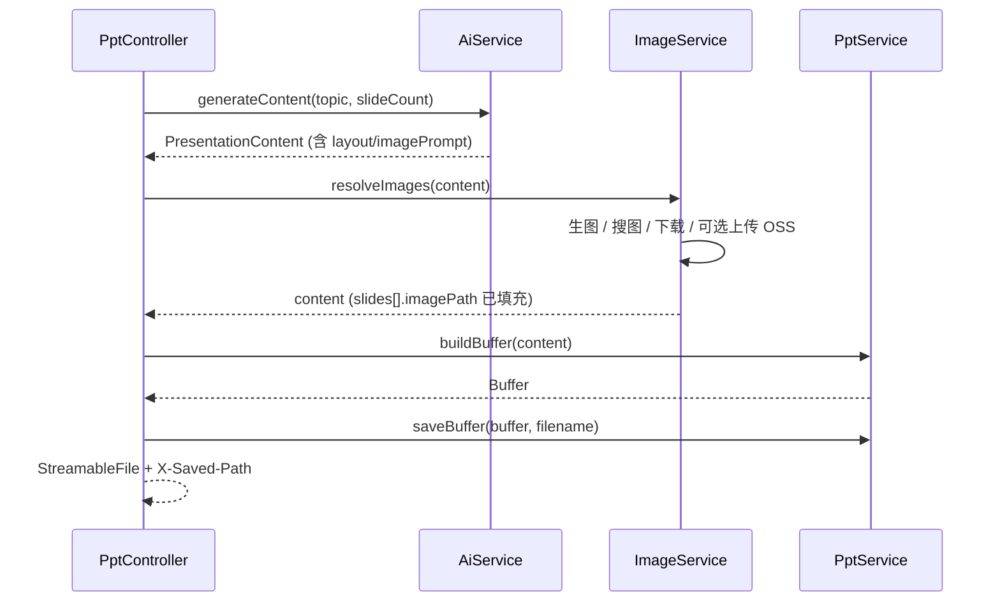

# 如何生成图文并茂的 PPT

> 本文档描述 ppt-agent 从「纯文字幻灯片」升级到「图文并茂演示稿」的设计方案与落地步骤。  
> 当前代码仍为 **纯文字版**；下文中的 TypeScript 片段为 **推荐实现**，可按优先级逐步合入。

---

## 目录

1. [现状与差距](#现状与差距)
2. [设计原则](#设计原则)
3. [目标架构](#目标架构)
4. [完整 JSON Schema](#完整-json-schema)
5. [改造步骤](#改造步骤)
6. [图片服务](#图片服务)
7. [版式与坐标](#版式与坐标)
8. [Controller 编排](#controller-编排)
9. [配置项](#配置项)
10. [降级与容错](#降级与容错)
11. [性能建议](#性能建议)
12. [测试与验收](#测试与验收)
13. [常见问题](#常见问题)
14. [实施路线图](#实施路线图)

---

## 现状与差距

### 当前流程

```
POST /ppt/generate { topic, slideCount }
        ↓
AiService.generateContent()     ← Prompt 只要 title + bullets
        ↓
PptService.buildBuffer()        ← 封面 + 纯 bullet 页
        ↓
saveBuffer() → output/*.pptx    ← 同时写本地 + 返回下载流
```

相关文件：

| 文件 | 职责 |
|------|------|
| `src/ai/ai.service.ts` | LLM 调用与 Prompt |
| `src/ai/types/slide-content.ts` | 内容类型定义 |
| `src/ppt/ppt.service.ts` | pptxgenjs 渲染 |
| `src/ppt/ppt.controller.ts` | HTTP 入口 |

### 当前 JSON 结构

```json
{
  "title": "演示标题",
  "slides": [
    { "title": "封面", "bullets": ["副标题"] },
    { "title": "第一章", "bullets": ["要点 1", "要点 2"] }
  ]
}
```

### 差距一览

| 能力 | 现状 | 图文并茂目标 |
|------|------|--------------|
| 版式 | 固定 2 种（封面 / 要点） | 6+ 种可切换 layout |
| 配图 | 无 | 每页可有 imagePrompt → 真实图片 |
| 主题色 | 硬编码 `#1E3A5F` | LLM 或模板输出 theme |
| 图表 | 无 | 数据页输出 chart 结构 |
| 图标 | 无 | bullets 旁可加 icon keyword |

---

## 设计原则

1. **LLM 只产出结构化描述，不产出二进制** — 图片 URL / 本地路径由 `ImageService` 填充。
2. **渲染与内容解耦** — 每种 `layout` 对应独立渲染函数，避免 `buildBuffer` 膨胀。
3. **图片优先本地化** — pptxgenjs 对远程 URL 依赖网络；生产环境建议「下载 → 临时目录 / base64 → 嵌入 pptx」。
4. **失败可降级** — 某页配图失败时回退到 `title-bullets`，不阻断整份 PPT。
5. **向后兼容** — 无 `layout` / `imagePrompt` 字段时，走现有纯文字逻辑。

---

## 目标架构



模块划分：

```
src/
├── ai/
│   ├── ai.service.ts              # Prompt + 解析 + 校验 layout
│   └── types/slide-content.ts     # 扩展 schema
├── image/                         # 新增
│   ├── image.module.ts
│   ├── image.service.ts           # resolveImages 编排
│   └── providers/
│       ├── wanx.provider.ts       # 百炼通义万相
│       ├── unsplash.provider.ts   # 图库（可选）
│       └── oss.provider.ts        # 阿里云 OSS 上传
└── ppt/
    ├── layouts/                   # 新增
    │   ├── types.ts
    │   ├── cover.layout.ts
    │   ├── title-bullets.layout.ts
    │   ├── image-left.layout.ts
    │   ├── image-right.layout.ts
    │   ├── full-image.layout.ts
    │   ├── two-column.layout.ts
    │   └── index.ts               # renderSlide(slide, ctx)
    └── ppt.service.ts             # 循环 slides → renderSlide
```

---

## 完整 JSON Schema

### TypeScript 类型（目标）

```typescript
// src/ai/types/slide-content.ts

export type SlideLayout =
  | 'cover'
  | 'title-bullets'
  | 'image-left'
  | 'image-right'
  | 'full-image'
  | 'two-column'
  | 'chart';

export interface PresentationTheme {
  primary: string;   // 主色，如 "1E3A5F"
  accent: string;    // 强调色，如 "3B82F6"
  background: string; // 内容页背景，如 "F8FAFC"
  text: string;      // 正文色，如 "334155"
}

export interface SlideChart {
  type: 'bar' | 'line' | 'pie';
  labels: string[];
  values: number[];
}

export interface SlideContent {
  title: string;
  bullets: string[];
  layout?: SlideLayout;
  /** LLM 输出：画面描述，供生图/搜图 */
  imagePrompt?: string;
  /** ImageService 填充：本地绝对路径或 base64 */
  imagePath?: string;
  /** 双栏布局：右栏标题与要点 */
  columnB?: { title: string; bullets: string[] };
  chart?: SlideChart;
  /** 要点旁图标关键词，可选 */
  iconKeywords?: string[];
}

export interface PresentationContent {
  title: string;
  theme?: PresentationTheme;
  slides: SlideContent[];
}
```

### LLM 输出示例（8 页）

```json
{
  "title": "2025 人工智能趋势",
  "theme": {
    "primary": "1E3A5F",
    "accent": "3B82F6",
    "background": "F8FAFC",
    "text": "334155"
  },
  "slides": [
    {
      "title": "2025 人工智能趋势",
      "layout": "cover",
      "bullets": ["技术洞察报告"],
      "imagePrompt": "abstract AI technology background, dark blue, minimal, no text"
    },
    {
      "title": "大模型持续进化",
      "layout": "image-right",
      "bullets": ["多模态成为标配", "推理成本快速下降", "端侧部署加速"],
      "imagePrompt": "neural network visualization, futuristic, blue gradient"
    },
    {
      "title": "云 vs 端：部署形态对比",
      "layout": "two-column",
      "bullets": ["弹性扩容", "运维成本低", "适合训练"],
      "columnB": {
        "title": "端侧部署",
        "bullets": ["低延迟", "隐私友好", "适合推理"]
      }
    },
    {
      "title": "全球 AI 投资规模（亿美元）",
      "layout": "chart",
      "chart": {
        "type": "bar",
        "labels": ["2022", "2023", "2024", "2025"],
        "values": [920, 1180, 1540, 1920]
      },
      "bullets": []
    },
    {
      "title": "总结",
      "layout": "full-image",
      "bullets": ["AI 正在从工具变为基础设施"],
      "imagePrompt": "sunrise over city skyline, hopeful, cinematic"
    }
  ]
}
```

### Prompt 改造要点

在 `AiService.buildPrompt` 中替换/追加：

```
Return JSON with this shape:
{
  "title": "...",
  "theme": { "primary", "accent", "background", "text" },
  "slides": [
    {
      "title": "...",
      "layout": "cover|title-bullets|image-left|image-right|full-image|two-column|chart",
      "bullets": ["..."],
      "imagePrompt": "optional, for layouts that need images",
      "columnB": { "title", "bullets" },
      "chart": { "type", "labels", "values" }
    }
  ]
}

Layout rules:
- Slide 1: layout=cover, include imagePrompt for background.
- At least 40% of content slides use image-left or image-right.
- Comparison topics → two-column with columnB.
- Numeric trends → chart layout with chart object.
- Closing slide → full-image.
- imagePrompt: concise visual description, no text in image, same language as topic.
- Exactly ${slideCount} slides.
```

`parseContent` 需增加校验：未知 `layout` 时 fallback 为 `title-bullets`。

---

## 改造步骤

### Step 1 — 扩展类型与 Prompt（P0）

- 修改 `slide-content.ts`
- 修改 `buildPrompt` / `parseContent`
- **不改渲染**，先打日志确认 LLM 能稳定输出新字段

### Step 2 — 新增 ImageService（P1）

见 [图片服务](#图片服务) 章节。

### Step 3 — 拆分 layout 渲染（P2）

见 [版式与坐标](#版式与坐标) 章节。

### Step 4 — 串联 Controller（P2）

见 [Controller 编排](#controller-编排) 章节。

### Step 5 — 主题色与图表（P3）

- `theme` 传入 layout context，替换硬编码颜色
- `chart` layout 调用 `page.addChart()`

---

## 图片服务

### 策略选择

| 策略 | 优点 | 缺点 | 推荐场景 |
|------|------|------|----------|
| **百炼通义万相** | 与现有 DashScope Key 共用；中文 prompt 友好 | 按张计费；需轮询异步任务 | 概念图、封面、抽象背景 |
| **Unsplash / Pexels** | 真实摄影；免费额度 | 英文检索更佳；版权需署名 | 人物、场景、产品 |
| **占位图 placeholder** | 零成本；开发调试快 | 美观度低 | 本地开发 / 降级 |
| **OSS 持久化** | URL 稳定；可复用 | 多一步上传 | 需要外链预览时 |

> 项目 `dev.config.yaml` 已预留 `aliyun_oss`、`qiniu`，上传后可得公网 URL；**嵌入 pptx 仍建议用本地路径**。

### ImageService 接口（推荐）

```typescript
// src/image/image.service.ts

@Injectable()
export class ImageService {
  constructor(
    private readonly config: ConfigService,
    private readonly wanx: WanxProvider,
    // private readonly unsplash: UnsplashProvider,
  ) {}

  /** 为所有含 imagePrompt 的 slide 填充 imagePath */
  async resolveImages(content: PresentationContent): Promise<PresentationContent> {
    const tmpDir = join(tmpdir(), 'ppt-agent-images', randomUUID());
    await mkdir(tmpDir, { recursive: true });

    await Promise.all(
      content.slides.map(async (slide, i) => {
        if (!slide.imagePrompt) return;
        try {
          slide.imagePath = await this.fetchToLocal(slide.imagePrompt, tmpDir, `slide-${i}.png`);
        } catch {
          // 降级：不设置 imagePath，layout 层回退纯文字
        }
      }),
    );

    return content;
  }

  private async fetchToLocal(prompt: string, dir: string, filename: string): Promise<string> {
    const provider = this.config.get<string>('image_provider') ?? 'wanx';
    const buffer =
      provider === 'wanx'
        ? await this.wanx.generate(prompt)
        : await this.placeholder(prompt);

    const filePath = join(dir, filename);
    await writeFile(filePath, buffer);
    return filePath;
  }
}
```

### 百炼通义万相（示例）

DashScope 图像生成一般为异步 API，流程：

```
POST /api/v1/services/aigc/text2image/image-synthesis
  → task_id
GET  /api/v1/tasks/{task_id}
  → results[0].url
下载 URL → Buffer → 本地文件
```

配置项（追加到 `dev.config.yaml`）：

```yaml
image_provider: wanx          # wanx | unsplash | placeholder
wanx_api_key: ${llm_api_key}  # 可与百炼共用
wanx_model: wanx-v1
```

### pptxgenjs 嵌入方式

```typescript
// 推荐：本地路径（ImageService 下载后）
page.addImage({
  path: slide.imagePath,
  x: 5.2, y: 1.0, w: 4.3, h: 4.8,
  rounding: true,
});

// 备选：base64（无需临时文件，体积更大）
page.addImage({
  data: `image/png;base64,${buffer.toString('base64')}`,
  x: 5.2, y: 1.0, w: 4.3, h: 4.8,
});

// 不推荐直接嵌远程 URL（生成时依赖外网，且部分环境会失败）
// page.addImage({ path: 'https://...' });
```

### OSS 上传（可选）

若需要将配图持久化或在前端预览：

```typescript
// 上传后得到 https://tx-res-01.oss-cn-guangzhou.aliyuncs.com/project/nobady/xxx.png
// 配置读取：aliyun_oss.oss_static_url + oss_static_path
const objectKey = `${ossStaticPath}/${Date.now()}_${filename}`;
await ossClient.put(objectKey, buffer);
const publicUrl = `${ossStaticUrl}/${objectKey}`;
// publicUrl 可用于预览；pptx 嵌入仍用本地 buffer/path
```

---

## 版式与坐标

画布：**16:9**，宽 10 英寸 × 高 5.625 英寸（pptxgenjs 默认）。

### 版式线框

```
cover                 image-right              two-column
┌─────────────────┐   ┌──────────┬─────────┐   ┌─────────┬─────────┐
│                 │   │ Title    │         │   │ Col A   │ Col B   │
│     TITLE       │   │ • bullet │  IMAGE  │   │ • ...   │ • ...   │
│    subtitle     │   │ • bullet │         │   │         │         │
│   [bg image]    │   └──────────┴─────────┘   └─────────┴─────────┘
└─────────────────┘

full-image              title-bullets (fallback)
┌─────────────────┐   ┌─────────────────┐
│                 │   │ Title           │
│   FULL IMAGE    │   │ • bullet        │
│▓▓▓▓▓▓▓▓▓▓▓▓▓▓▓▓▓│   │ • bullet        │
│  Title overlay  │   └─────────────────┘
└─────────────────┘
```

### 坐标表

| layout | 元素 | x | y | w | h |
|--------|------|---|---|---|---|
| **cover** | 标题 | 0.5 | 2.2 | 9 | 1.5 |
| **cover** | 副标题 | 0.5 | 3.8 | 9 | 0.8 |
| **cover** | 背景图 | 0 | 0 | 10 | 5.625 |
| **image-left** | 图片 | 0.3 | 1.0 | 4.2 | 4.8 |
| **image-left** | 标题 | 4.8 | 0.4 | 4.7 | 0.8 |
| **image-left** | 要点 | 4.8 | 1.4 | 4.7 | 4.5 |
| **image-right** | 标题 | 0.5 | 0.4 | 4.5 | 0.8 |
| **image-right** | 要点 | 0.5 | 1.4 | 4.5 | 4.5 |
| **image-right** | 图片 | 5.2 | 1.0 | 4.3 | 4.8 |
| **full-image** | 图片 | 0 | 0 | 10 | 5.625 |
| **full-image** | 遮罩条 | 0 | 4.0 | 10 | 1.625 |
| **full-image** | 标题 | 0.5 | 4.3 | 9 | 1.0 |
| **two-column** | 左标题 | 0.4 | 0.4 | 4.5 | 0.7 |
| **two-column** | 左要点 | 0.4 | 1.2 | 4.5 | 4.3 |
| **two-column** | 右标题 | 5.1 | 0.4 | 4.5 | 0.7 |
| **two-column** | 右要点 | 5.1 | 1.2 | 4.5 | 4.3 |

### layout 调度（推荐）

```typescript
// src/ppt/layouts/index.ts

export interface LayoutContext {
  pptx: PptxGenJS;
  slide: SlideContent;
  page: PptxGenJS.Slide;
  index: number;
  theme: PresentationTheme;
}

const renderers: Record<SlideLayout, (ctx: LayoutContext) => void> = {
  cover: renderCover,
  'title-bullets': renderTitleBullets,
  'image-left': renderImageLeft,
  'image-right': renderImageRight,
  'full-image': renderFullImage,
  'two-column': renderTwoColumn,
  chart: renderChart,
};

export function renderSlide(ctx: LayoutContext): void {
  const layout = ctx.slide.layout ?? (ctx.index === 0 ? 'cover' : 'title-bullets');
  const fn = renderers[layout] ?? renderers['title-bullets'];
  fn(ctx);
}
```

### image-right 示例

```typescript
export function renderImageRight({ slide, page, theme }: LayoutContext): void {
  page.background = { color: theme.background };

  page.addText(slide.title, {
    x: 0.5, y: 0.4, w: 4.5, h: 0.8,
    fontSize: 28, bold: true, color: theme.primary,
  });

  if (slide.bullets?.length) {
    page.addText(
      slide.bullets.map((b) => ({ text: b, options: { bullet: true } })),
      { x: 0.5, y: 1.4, w: 4.5, h: 4.5, fontSize: 18, color: theme.text, valign: 'top' },
    );
  }

  if (slide.imagePath) {
    page.addImage({
      path: slide.imagePath,
      x: 5.2, y: 1.0, w: 4.3, h: 4.8,
      rounding: true,
    });
  }
}
```

### full-image 半透明遮罩

```typescript
page.addImage({ path: slide.imagePath, x: 0, y: 0, w: 10, h: 5.625 });
page.addShape('rect', {
  x: 0, y: 4.0, w: 10, h: 1.625,
  fill: { color: theme.primary, transparency: 40 },
});
page.addText(slide.title, {
  x: 0.5, y: 4.3, w: 9, h: 1.0,
  fontSize: 32, bold: true, color: 'FFFFFF',
});
```

---

## Controller 编排

改造后的 `generate` 流程：

```typescript
@Post('generate')
async generate(@Body() dto: GeneratePptDto, @Res({ passthrough: true }) res: Response) {
  let content = await this.aiService.generateContent(dto.topic, dto.slideCount);
  content = await this.imageService.resolveImages(content);  // 新增
  const buffer = await this.pptService.buildBuffer(content);
  const filename = `${this.sanitizeFilename(content.title)}.pptx`;
  const savedPath = await this.pptService.saveBuffer(buffer, filename);

  res.set({
    'Content-Type': 'application/vnd.openxmlformats-officedocument.presentationml.presentation',
    'Content-Disposition': this.buildContentDisposition(filename),
    'X-Saved-Path': savedPath,
  });

  return new StreamableFile(buffer);
}
```

`PptModule` 需 `imports: [ImageModule]`。

---

## 配置项

在 `dev.config.yaml` 中建议追加：

```yaml
PORT: 3000
output_dir: ./output

# LLM（已有）
llm_api_key: "your-key"
llm_base_url: "https://dashscope.aliyuncs.com/compatible-mode/v1"
llm_model: "qwen3.6-plus"

# 图片（新增）
image_provider: wanx              # wanx | unsplash | placeholder
wanx_api_key: "your-key"          # 可与 llm_api_key 相同
wanx_model: wanx-v1
unsplash_access_key: ""           # 可选

# OSS（已有，用于持久化预览）
aliyun_oss:
  oss_bucket: 'your-bucket'
  oss_static_url: 'https://...'
  oss_static_path: 'project/ppt-agent'
```

---

## 降级与容错

| 场景 | 处理方式 |
|------|----------|
| 生图 API 超时 | 跳过 `imagePath`，该页用 `title-bullets` |
| LLM 输出未知 layout | 映射为 `title-bullets` |
| LLM 未输出 theme | 使用默认主题（与当前硬编码色一致） |
| chart 数据缺失 | 回退 `title-bullets`，把 labels 写入 bullets |
| 图片文件损坏 | `addImage` 前检查文件大小 > 0 |

默认主题（与现网一致）：

```typescript
const DEFAULT_THEME: PresentationTheme = {
  primary: '1E3A5F',
  accent: '3B82F6',
  background: 'F8FAFC',
  text: '334155',
};
```

---

## 性能建议

1. **并行生图** — `Promise.all` 处理各页 `imagePrompt`，8 页串行可能 2–4 分钟，并行可压到最慢单张的时间。
2. **缓存** — 相同 `imagePrompt` hash 命中本地/OSS 缓存，避免重复生图。
3. **超时** — 单张图片建议 30s 超时；整体请求可放宽到 120s 或改异步任务（返回 taskId，轮询下载）。
4. **临时文件清理** — 生成完成后 `rm` 临时目录；或定期清理 `os.tmpdir()/ppt-agent-images`。
5. **slideCount 上限** — 已有 `@Max(30)`；图文并茂时建议默认 ≤ 12，避免生图成本过高。

---

## 测试与验收

### 当前 API 冒烟（纯文字）

```bash
curl -X POST http://localhost:3000/ppt/generate \
  -H "Content-Type: application/json" \
  -d '{"topic":"NestJS 入门","slideCount":6}' \
  -D /tmp/ppt-headers.txt \
  -o nestjs-intro.pptx

grep X-Saved-Path /tmp/ppt-headers.txt
file nestjs-intro.pptx   # 应显示 Zip archive / OOXML
```

### 图文并茂验收清单

- [ ] 封面有背景图或深色主题块
- [ ] 至少 40% 内容页带配图
- [ ] 对比类页面使用双栏 layout
- [ ] 含数字趋势的页面有 chart
- [ ] 任意一页生图失败，整份 PPT 仍能下载
- [ ] 中文标题下载文件名正确（`filename*` 头）
- [ ] `output/` 下保存的 pptx 可用 PowerPoint / Keynote 打开

### 开发阶段调试技巧

```bash
# 只测 LLM JSON 输出（临时在 controller 打日志）
curl -s ... | jq .

# 使用 placeholder  provider 跳过真实生图
image_provider: placeholder
```

---

## 常见问题

**Q: pptxgenjs 加图后文件打不开？**  
A: 检查图片是否为有效 PNG/JPEG；路径是否存在；base64 前缀是否为 `image/png;base64,`。

**Q: 远程 URL 嵌入失败？**  
A: 改为 ImageService 先 `axios.get(url, { responseType: 'arraybuffer' })` 下载到本地再嵌入。

**Q: 生图 prompt 写中文还是英文？**  
A: 万相对中文友好；Unsplash 建议英文关键词。可在 Prompt 中要求 LLM 同时输出 `imagePromptEn` 供图库使用。

**Q: 为什么 LLM 不输出 layout？**  
A: 检查 `response_format: json_object` 是否生效；Prompt 中是否给出完整 schema 与示例；可适当提高 `temperature` 或换更强模型。

**Q: Content-Disposition 中文乱码？**  
A: 已用 RFC 5987 `filename*=UTF-8''` 处理，见 `ppt.controller.ts` 的 `buildContentDisposition`。

---

## 实施路线图

| 阶段 | 内容 | 预估工时 | 产出 |
|------|------|----------|------|
| **P0** | 扩展 schema + Prompt + 解析校验 | 0.5d | LLM 输出 layout/imagePrompt |
| **P1** | ImageService + placeholder/wanx | 1–2d | slides 有 imagePath |
| **P2** | layouts 拆分 + cover/image-right/two-column | 1–2d | 视觉明显提升 |
| **P3** | theme + chart + OSS 缓存 | 1d | 完整图文并茂 |
| **P4** | 异步任务 / 进度查询（可选） | 2d | 长任务不阻塞 HTTP |

按 **P0 → P1 → P2** 顺序推进，每阶段可独立上线；API 路径与请求体 **无需变更**，对调用方透明。

---

## 参考链接

- [PptxGenJS — Images](https://gitbrent.github.io/PptxGenJS/docs/api-images/)
- [PptxGenJS — Charts](https://gitbrent.github.io/PptxGenJS/docs/api-charts/)
- [阿里云百炼 — 通义万相](https://help.aliyun.com/zh/model-studio/developer-reference/wanx-image-generation)
- [Unsplash API](https://unsplash.com/developers)
